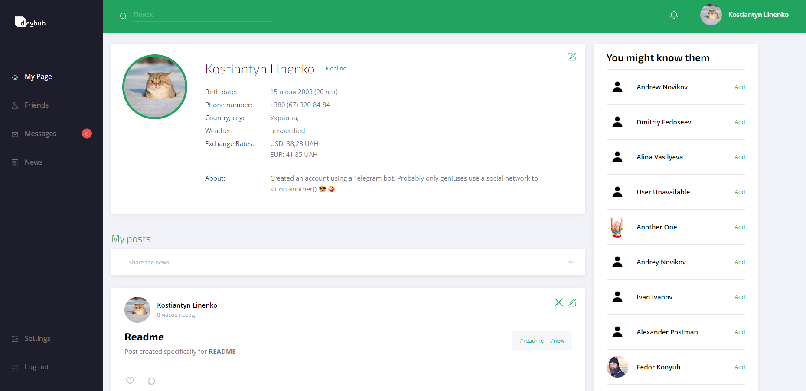
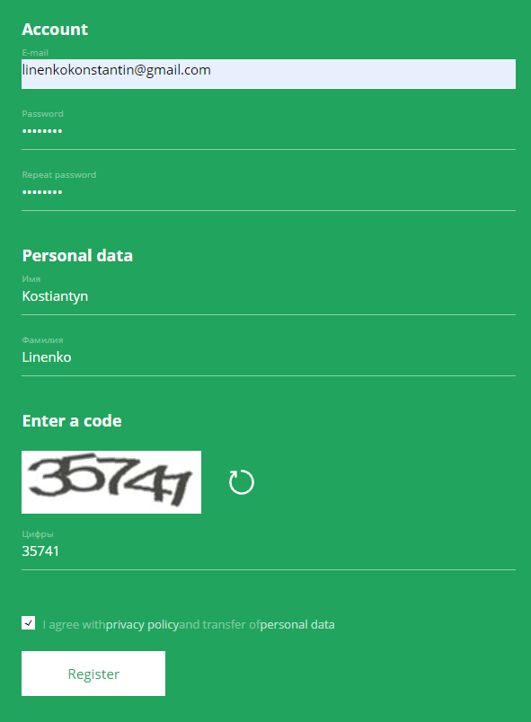
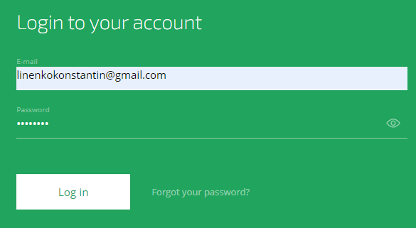
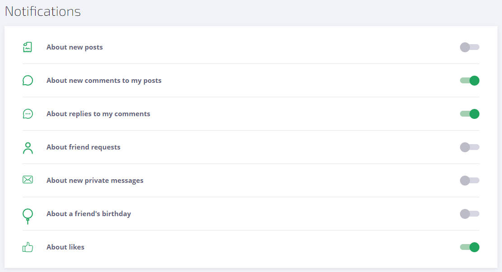
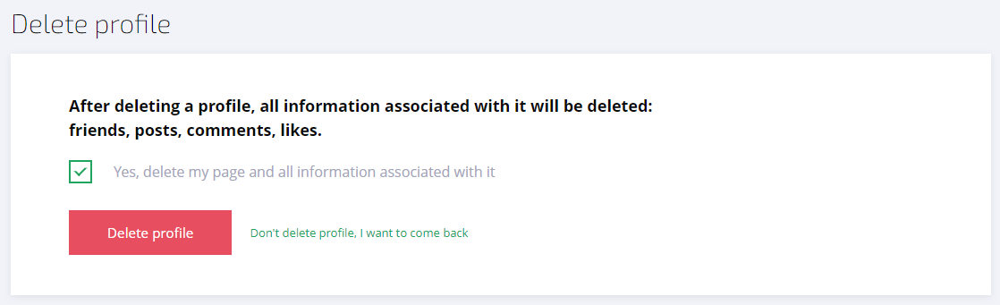
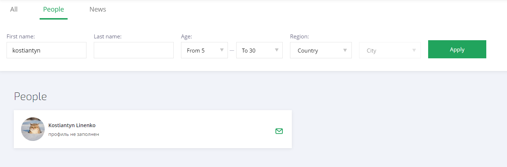
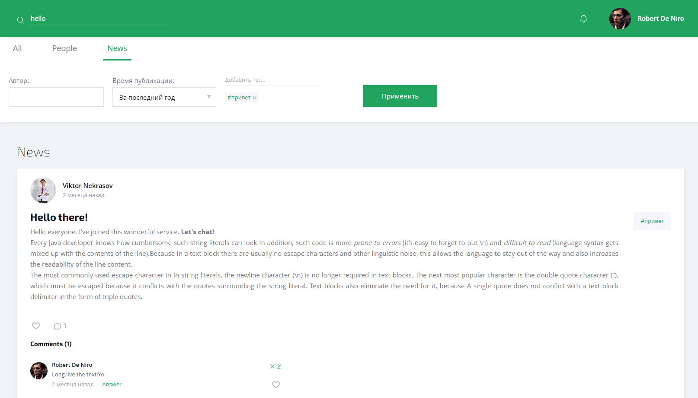
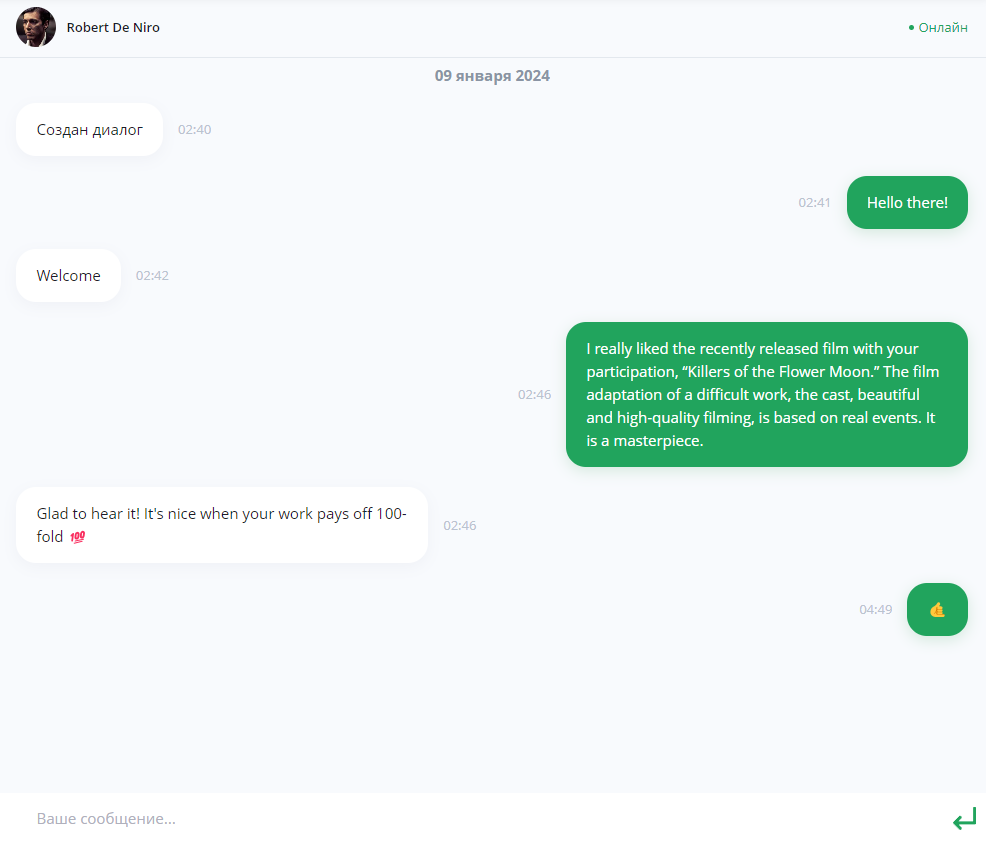
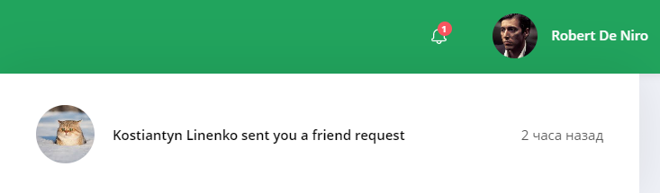

<h1 align="center">DevHub Social Network</h1>

<p align="center">


</p>

---

## Technology Stack
+ Java 17, Maven
+ Spring Framework: JPA, Security, Logging, Websocket, AOP
+ Spring Boot 3
+ PostgreSQL, Liquibase, Amazon S3
+ Documentation: Swagger
+ Testing: jUnit 5, Testcontainters, Mockito
+ CI/CD: GitLab Runner
+ Monitoring/Analysis: Prometheus, SonarQube, Grafana

---

## Description

**DevHub** :iphone: is a place where you can develop and feel as comfortable as possible in the circle of nice people. 
This is a community of professionals united by one idea - `with the help of code, magic will become reality`!
The project provides an opportunity for users to freely express their thoughts, show their creativity by creating posts 
and commenting on other people's posts. Everyone will be able to find like-minded people and communicate on topics 
that interest them, regardless of location, all over the world! :sunglasses:



---

## Functionality
### 1. Registration/authorization

+ To **register** , a new user must enter his email, password, first and last name, and also confirm the captcha :ballot_box_with_check:.



+ To **log in**, the user enters his email and password.



### 2. News feed
+ On your personal page you can view your posts with the ability to edit and delete them, as well as create a new post.


+ In the **News** tab you can view the most current news and interact with them.


### 3. Working with profile and images
The project provides a number of opportunities for working with a personal profile:
+ **Entering and editing personal data**.


+ **Setting up notifications**.



+ **Change and restore password**.
  The user can either change the password or recover it. A letter with the necessary instructions will be sent to your current email address.


+ **Account deletion**.
  Before deleting his profile, the user must confirm his action or refuse.



### 4. Search for users and posts by all comments
There is a global search :mag: in which you can search for other users or posts using certain criteria.

+ Users can be searched for:
  + *First* and *last name*
  + *Age*
  + *Region* or *city*



+ Posts can be searched by:
  + *Author*
  + *Time of publication*
  + *Tags*



### 5. Friends and recommendations
Interaction with other users has been implemented, in particular you can:

+ Add people as friends and cancel outgoing requests
+ Accept and reject incoming requests
+ Block and unblock users
+ View recommendations - people we may know `(special algorithms are used to select candidates)`


### 6. Communication and notifications

+ Everyone has the opportunity to communicate with other users only if you have not annoyed them and they have not blocked you :trollface:.

> [!NOTE]
> The chat implementation is written using **WebSocket**, so you can communicate in real time, as expected.



+ In accordance with the settings, the user can receive various types of notifications:
  + New posts
  + Comments and likes on posts
  + Replies to your comments
  + Friend requests
  + Messages
  + Friends birthdays



### 7. Admin panel
This component of the project is implemented in a separate application. Its goal is consistent with the name - administration of a social network.
Here you can:
+ View site statistics: likes, posts, registered users, etc.
+ Manage user accounts

> You can view the application [here](https://github.com/KonstantinLi/socialnet_admin)

### 8. Telegram bot
[Telegram bot](https://github.com/KonstantinLi/socialnet_bot) provides an alternative and, most importantly, convenient interface,
which implemented exactly the same functionality as a standard frontend application. The main advantage of a telegram bot
is that the user will be able to easily access the API using his mobile phone, wherever he is.

---

## Solved issues
### 1. Status Online
Online status updating is carried out through the aspect [@OnlineStatusChecker](src/main/java/com/socialnet/aspect/OnlineStatusChecker.java),
which uses a special annotation [OnlineStatusUpdate](src/main/java/com/socialnet/annotation/OnlineStatusUpdate.java).
This annotation marks all methods that tell the system that the user is active.

### 2. Simplify logging
#### Configuration
Logging is handled by the **Log4j2** library. [Here](src/main/resources/log4j2.xml) 3 appenders are declared:
+ ConsoleAppender works with the console, 
+ FileAppender and ErrorFileAppender with files. 

In addition, archiving of logs is provided, which will subsequently be sent to remote storage. 
The config retrieves the console.thresholdFilter property from outside, which filters the output of logs to the console. 
If the project is at the development stage (*dev* profile), all logs will be output to the console; 
if the project is rolled out to *production*, nothing will be output to the console (to file only) 
– `this can significantly reduce the load on server`.

#### Automation
To avoid manual logging, bring all logs to a single format and automate this process,
**Aspect-oriented programming** is used. The aspect [@LoggingAspect](src/main/java/com/socialnet/aspect/LoggingAspect.java) 
covers all classes that are within the root package and that have specific annotations.
The annotations [@Info](src/main/java/com/socialnet/annotation/Info.java) and [@Debug](src/main/java/com/socialnet/annotation/Debug.java) 
are marked above the classes, which means the output logs for all methods. 
[@InfoLoggable](src/main/java/com/socialnet/annotation/InfoLoggable.java), 
[@DebugLoggable](src/main/java/com/socialnet/annotation/DebugLoggable.java), 
[@NotLoggable](src/main/java/com/socialnet/annotation/NotLoggable.java) are marked above specific methods. 
Depending on the selected annotations, a section of code can be logged at the ***debug*** or ***info*** levels.

#### Remote storage
***AWS S3 Bucket*** is used as remote storage :floppy_disk:. According to the AWS SDK documentation for Java, a class has been created
[AwsLogManager](src/main/java/com/socialnet/dto/AwsLogManager.java), which will asynchronously and in multi-threaded mode
send logs to storage, and also delete old archives. The class implements the interface
[LogUploader](src/main/java/com/socialnet/dto/LogUploader.java). In the future, you may need to change the service,
and this will greatly simplify the implementation replacement. The execution of methods is also controlled by the scheduler.

### 3. Notifications via Websocket
#### Configuration
To work with the WebSocket protocol within a **Spring Boot** application to get started
you need to activate its capabilities. A configuration class has been created for this purpose,
annotated with ***@EnableWebSocketMessageBroker***, which indicates the use of an in-memory message broker. Here a *STOMP* endpoint is declared, at which
sources can send messages. *SockJS* is also included, so there's ability to use alternative messaging methods because so far
not all browsers support WebSockets. If the client sends a message of type CONNECT, we get a token and create an object based on 
UserPrincipal, which is needed for user authentication.

#### Sending notifications
> [!NOTE]
> Events, the processing of which must include working with messages, 
> occur during the operation of different services that are not interconnected.

For this, the AOP principle was applied, which will unite all these services, or rather 
sections of code where you need to generate and send a message :incoming_envelope:. Notification service
[NotificationService](src/main/java/com/socialnet/service/NotificationService.java) works around the MessagingTemplate object,
which makes it easy to send messages from the server to the WebSocket client. Depending on the event we create an object 
that contains detailed information about this event:
+ notification type,
+ message text,
+ to whom and from whom it will be sent.

For a specific type of friend's birthday notification, ***planner*** works,
which every day at midnight send messages to all people whose friends have a birthday today.
```java
    @Scheduled(cron = "0 0 0 * * *")
    protected void sendBirthdayNotification() {
        notificationService.sendBirthdayNotification();
    }
```

### 4. Security with JWT
#### Configuration
+ To start working with the Security module, you need to configure it :wrench: in accordance with the requirements for the project.
  Since JWT will be used, it should be noted that no information will be stored in the user session,
  because access rights to a resource are checked using a token, which is located in the header of each request.
  To do this, **STATELESS** session management policy was defined.

```java
sessionManagement(manager -> manager.sessionCreationPolicy(SessionCreationPolicy.STATELESS)
```

+ When an unauthorized user tries to access a protected resource :lock:, exceptions will be thrown, 
which will subsequently be caught by ExceptionHandler and returned a response to the client application.

```java
exceptionHandling(handler -> handler.authenticationEntryPoint((request, response, ex) ->
            response.sendError(HttpServletResponse.SC_UNAUTHORIZED, ex.getMessage()))
```

+ A custom [JwtRequestFilter](src/main/java/com/socialnet/security/JwtRequestFilter.java) has been added to the filter chain.
  which will validate the JWT token.

+ Configured the **CORS** mechanism to prevent requests from being made to resources on a different domain than 
+ the one that will refer to the client application

#### JWT generation
The **JJWT** library is used to generate the token. Here we use *id* and *email* of the user, the term for overdue
token and secret.

```java
Jwts.builder()
        .setClaims(claims)
        .setSubject(person.getId() + "," + person.getEmail())
        .setIssuedAt(now)
        .setExpiration(expired)
        .signWith(SignatureAlgorithm.HS256, jwtProperties.getSecret())
        .compact();
```

### 5. Swagger documentation
Swagger documentation requires a cumbersome overlay on controller classes and methods. To preserve readability
and refraining from *boilerplate* code, all logic was hidden in separate annotations:
+ [@AuthRequired](src/main/java/com/socialnet/annotation/swagger/AuthRequired.java) - authentication required.
+ [@BadRequestResponseDescription](src/main/java/com/socialnet/annotation/swagger/BadRequestResponseDescription.java) - description of 400 status code.
+ [@ParameterDescription](src/main/java/com/socialnet/annotation/swagger/ParameterDescription.java) - request parameter description.
+ [@Token](src/main/java/com/socialnet/annotation/swagger/Token.java) - presence of a token in the request.
+ [@FullSwaggerDescription](src/main/java/com/socialnet/annotation/swagger/FullSwaggerDescription.java) - aggregation of all the above annotations.

### 6. Scheduler
[Scheduler](src/main/java/com/socialnet/scheduler/Scheduler.java) - is an integral part of the project. He deals with:
+ The actual deletion of posts from the database that were requested to be deleted by users.
+ Uploading logs to a remote storage and deleting outdated logs.
+ Sending notifications about birthdays.
+ Etc.

### 7. Transforming entities to DTOs
Entities are an *object-oriented* representation of records in database tables. DTOs are used to *store* useful information, 
they are mainly used to work in controllers. The structure of these object types can differ significantly, 
even if they are semantically similar. To simplify the transformation of one object type into another, 
the **Mapstruct** library is used, which perfectly separates service code from application code. 
All the logic necessary for the transformation is contained in the corresponding mapper classes.

### 8. Database backup
A script has been written that periodically creates a backup of the current version of the database.
```shell
#!/bin/bash
#configuration settings
POSTGRES_USER=user
POSTGRES_DB=db
CURRENT_MONTH=$(date +%Y-%m)
CURRENT_DATE=$(date +%Y-%m-%d)
CURRENT_DATETIME=$(date +%d-%b-%Y_%H_%M_%Z)
BACKUPS_PATH=/backup
####################################
#backup PostgreSQL database
BACKUP_FOLDER=$BACKUPS_PATH/$CURRENT_MONTH/$CURRENT_DATE
if [ ! -d "$BACKUP_FOLDER" ]; then
    mkdir -p "$BACKUP_FOLDER"
fi

echo 'Creating PostgreSQL backups...'
cd "$BACKUP_FOLDER"
db_backup_filename=$POSTGRES_DB'_'$CURRENT_DATETIME'.tar'
docker exec java-backend-pg pg_dump -U $POSTGRES_USER -F t -d $POSTGRES_DB > 'dump_'"$db_backup_filename"

echo 'dump done'

aws s3 cp "$BACKUP_FOLDER"'/dump_'"$db_backup_filename" s3:'//socialnet-backup/backup-'"$CURRENT_DATE"'.tar' --grants read=uri=http://acs.amazonaws.com/groups/global/AllUsers

echo 'aws s3 copied done'

```

---

Thank you for watching! :blush::fire: